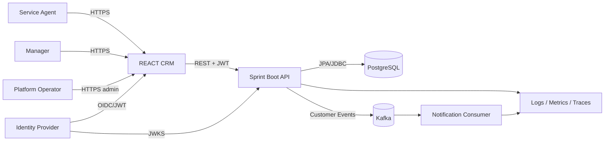

# Design Containers and Data Flow

# Ownership Candidates

- **Customer** - Owned by CustomerService. Authoritative source of truth for customer identity.
- **Notifications** - Estimated to be a future NotificationService. Dependent on the scope of this file
