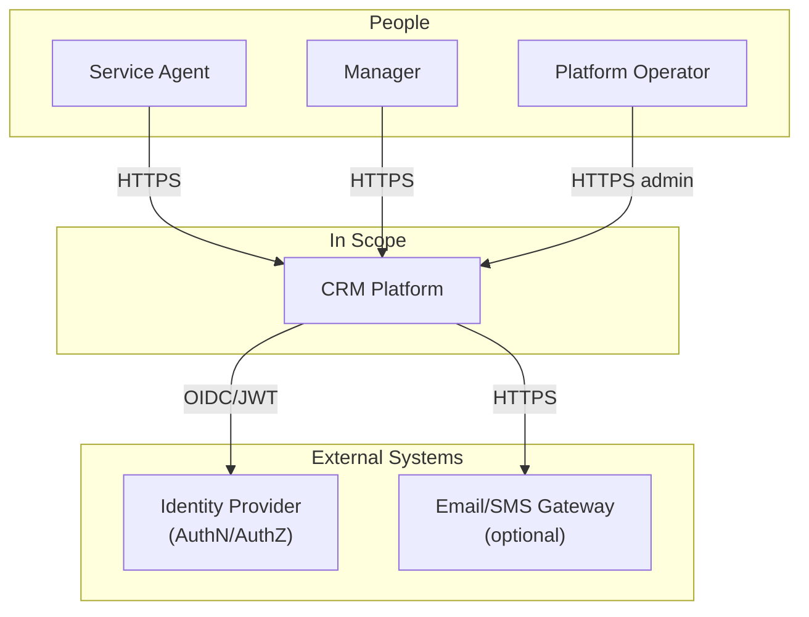

# Product Outcome

## Primary Users

- Agent
- Manager
- Operator

## Journeys

- Search for existing customers (Amina and/or Ravi)
- View profile
- Record and log interactions
- Change status (within scope)

## In-Scope Capabilities vs Explicit Exclusions

### Capabilities

### Exclusions

## Success Measures (Tied to lab 52)

## Questions with owners and due dates

# System Context View

