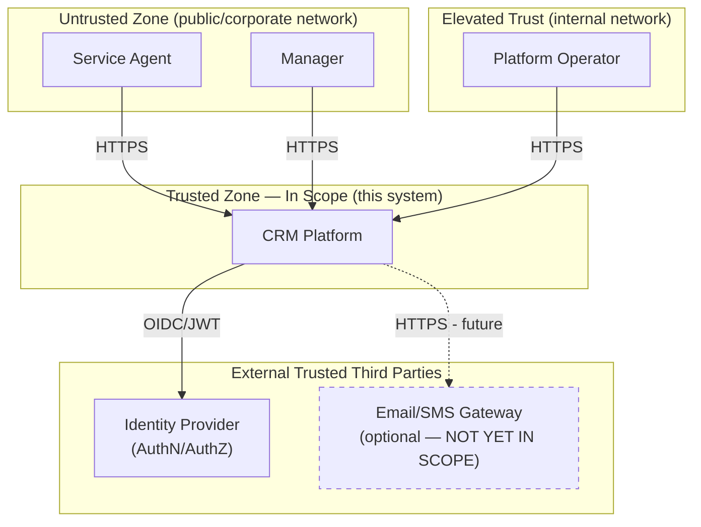

# C4 Context — Customer Management Platform

## Product outcome

- **Primary outcome:** Agents record and retrieve customer interactions in one authenticated journey. Every write leaves a durable row and a traceable audit event.
- **In scope for Week 6:** Search, profile + timeline, record interaction, `PROSPECT`→`ACTIVE`, JWT with AGENT/MANAGER, versioned events, health/metrics/correlation IDs, pipeline to k3s with rollback.
- **Explicit exclusions:** Billing/payments, legacy PII import, outbound email/SMS delivery, `Case` aggregate, transactional outbox. Full list with reasons in `backlog.md`.
- **Success measure (demo):** Agent records interaction for `CUS-1001` with `lab-request-001` and can prove UI→API→DB→event (Labs 49–52).

## Actors / systems

| Actor / system | Role | Trust boundary notes |
| -------------- | ---- | -------------------- |
| Service agent | Search, profile, record interaction. Claim `AGENT` | Untrusted browser; server-side validation is authoritative |
| Manager | Approves `PROSPECT`→`ACTIVE`, reviews audit. Claim `MANAGER` | Authority from the token claim, never a UI flag |
| Platform operator | Applies manifests, reads health, runs rollback. Not a CRM user | Inside the cluster boundary; holds deploy credentials, not customer data |
| IdP / JWT issuer | Signs login tokens, publishes JWKS (the public keys the API checks signatures against) | External trust anchor; API verifies signature only, no sessions |
| React CRM UI | Renders the journey, attaches token + correlation ID | Public edge; treated as untrusted input |
| Spring Boot API | Login checks, roles, validation, transactions, event publish | Owns the security boundary; every `/api/**` route is denied unless a rule allows it |
| PostgreSQL | System of record: customers, interactions, audit | In-cluster only; credentials from a k8s secret |
| Kafka | Async transport for versioned interaction events | In-cluster only; payloads carry IDs and type, never `summary` |
| Observability | Actuator health/metrics + structured logs with correlation ID | Read-only; `/actuator/health/liveness` is the only route that needs no login |

## Context diagram

## System Context Diagram (with Trust Boundaries)

**Out of scope for this iteration:** Email/SMS Gateway integration is shown 
for future extensibility but is not implemented in the current system 
boundary. Case management and Kafka event internals are also out of scope 
for this context-level view — see `container.md`.

## Open questions

| # | Question | Owner | Due | Resolution |
| - | -------- | ----- | --- | ---------- |
| Q1 | Real IdP issuer or static-key test issuer? Decides if JWKS is a live dependency (R2) | `[DELIVERY]` | Mon 17 Aug | |
| Q2 | Which k3s namespace may Team D apply to, and who holds the credential? | `[DELIVERY]` | Tue 18 Aug | |
| Q3 | Must the notification side effect do anything observable, or is an audit row enough? | `[BACKEND]` | Mon 17 Aug | |
| Q4 | Is the elevated claim `MANAGER` or `ADMIN`? Lab guide and capstone brief disagree (R2) | `[FRONTEND]` | Tue 18 Aug | |

## Fixture anchors (must appear in demo stories)

| ID | Name | Notes |
| -- | ---- | ----- |
| `CUS-1001` | Amina Khan | `ACTIVE` — primary interaction demo |
| `CUS-1002` | Ravi Singh | `PROSPECT` → `ACTIVE` |
| `CUS-9999` | — | not-found paths |
| `lab-request-001` | — | correlation ID |
