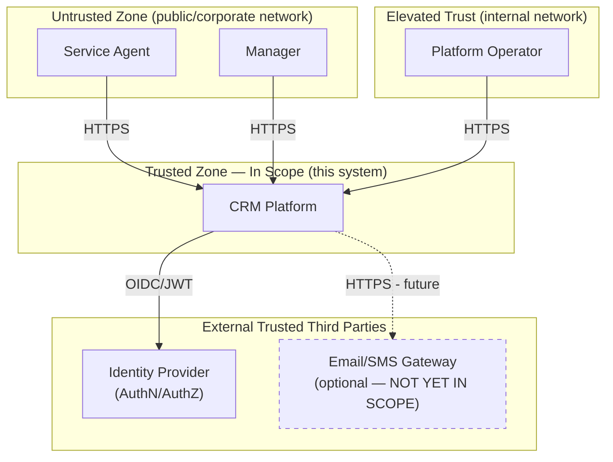

# C4 Context — Customer Management Platform

> **TODO (session block):** Replace every `_____` / stub box. Fixtures: `CUS-1001` Amina, `CUS-1002` Ravi, correlation `lab-request-001`.

## Product outcome

- **Primary outcome:** Service Agents can locate a customer and view their full interaction history in under [X] seconds, reducing average case handling time and eliminating agent context-switching between systems. New agents reach productivity (defined as completing standard lookups unassisted) within their first week, supported by in-app documentation.
- **In scope for Week 6:** React Frontend UI, Spring Boot Backend, PostgreSQL integration, Notifications, Kafka Events, Logs/Metrics/Traces, Identity Provider.
- **Explicit exclusions:** Billing, real PII import, digital storefront.
- **Success measure (demo):** Agent records interaction for `CUS-1001` with `lab-request-001` and can prove UI→API→DB→event (Labs 49–52).

## Actors / systems

| Actor / system | Role | Trust boundary notes |
| -------------- | ---- | -------------------- |
| Service agent | Human End-User; authenticates and interacts with CRM | Untrusted origin - outside permiter until authenticated via IdP. |
| IdP / JWT issuer | External identity provider; authenticates users and issues signed JWTs | Trusted External System, outside of CRM's own trust boundary. |
| React CRM UI | Client-Side Frontend | Runs in user's browser - untrusted execution environment; never holds long-term secrets. |
| Spring Boot API | Backend Application layer; owns business logic | Trust boundary starts here. |
| PostgreSQL | Data Store; system of records | Fully inside trusted boundary. |
| Kafka | Event backbone; carries domain events | Inside trusted boundary; still requires authz to access. |
| Observability | Cross-cutting infrastructure; collects logs, metrics, traces | Inside trusted boundary but must avoid leaking sensitive data into logs/traces. |

## Context diagram (stub)

**Out of scope for this iteration:** Email/SMS Gateway integration is shown 
for future extensibility but is not implemented in the current system 
boundary. Case management and Kafka event internals are also out of scope 
for this context-level view — see `container.md`.

## Fixture anchors (must appear in demo stories)

| ID | Name | Notes |
| -- | ---- | ----- |
| `CUS-1001` | Amina Khan | `ACTIVE` — primary interaction demo |
| `CUS-1002` | Ravi Singh | `PROSPECT` → `ACTIVE` |
| `CUS-9999` | — | not-found paths |
| `lab-request-001` | — | correlation ID |
