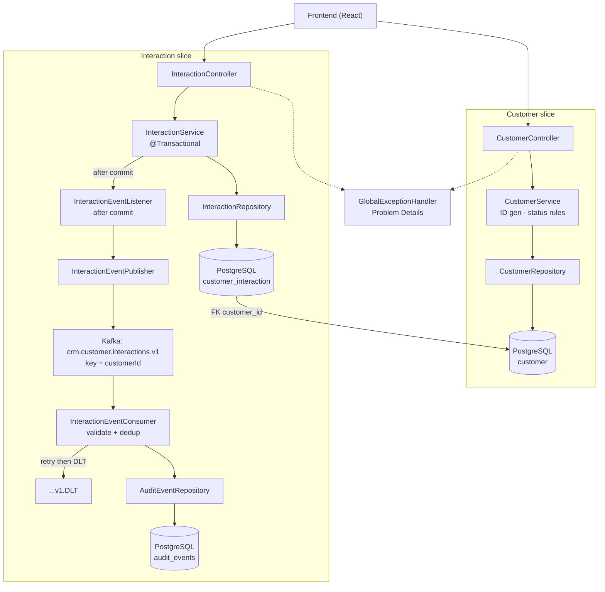

# Backend architecture — Northstar CRM (Lab 49)

This backend is bigger than it looks at first glance, but it's built from two nearly identical, repeating patterns — once you understand one slice, you understand the other. This doc walks through both, then tells you exactly what you need to wire up on the frontend.



Two independent vertical slices, each following the same layering:

```
Controller → Service → Repository → PostgreSQL
```

The **Interaction** slice has one extra piece bolted on the end: after a database write commits, it publishes an event to Kafka, which a separate consumer picks up and records to an audit table. That's the only place messaging shows up — the **Customer** slice is pure CRUD with no messaging at all.

## Why it's split into two slices

- **Customer slice** — customer records (create, look up, search, change lifecycle status). No Kafka involved.
- **Interaction slice** — logging a contact/interaction against a customer, plus the audit trail behind it.

They connect at exactly one point: every interaction has a `customer_id` that's a real foreign key into the `customer` table. Everything else about the two slices is independent — different controllers, different services, different repositories, different tests.

## Components, layer by layer

### API layer (`com.northstar.crm.api`)
| Component | Job |
|---|---|
| `CustomerController` | The 4 customer endpoints (see table below) |
| `InteractionController` | The 2 interaction endpoints |
| `GlobalExceptionHandler` | Catches exceptions from either controller and turns them into a consistent JSON error shape (RFC 7807 "Problem Details") — this is why every error you get back looks the same regardless of which endpoint threw it |

### Service layer (`com.northstar.crm.service`)
| Component | Job |
|---|---|
| `CustomerService` | Business rules: generates the next `CUS-XXXX` ID on create, enforces which status transitions are legal, throws on unknown customers |
| `InteractionService` | Validates the customer exists (via `CustomerRepository`), saves the interaction, kicks off the after-commit event publish |

### Persistence (`com.northstar.crm.repo`, `com.northstar.crm.domain`)
| Component | Job |
|---|---|
| `CustomerRepository` | Standard JPA repository, plus one custom search-by-name query |
| `InteractionRepository` | Standard JPA repository, plus a "get customer's timeline, newest first" query |
| `AuditEventRepository` | Backs the Kafka consumer's audit trail — not called from any REST endpoint |
| `Customer`, `Interaction`, `AuditEvent` | The three JPA entities / database tables |

### Messaging (`com.northstar.crm.messaging`) — Interaction slice only
| Component | Job |
|---|---|
| `InteractionEventFactory` | Builds the Kafka event payload from a saved interaction |
| `InteractionEventListener` | Fires **only after the database transaction commits** — this is deliberate, so an event never gets published for a row that didn't actually get saved |
| `InteractionEventPublisher` | Sends the event to the `crm.customer.interactions.v1` Kafka topic, keyed by `customerId` |
| `InteractionEventConsumer` | Reads that topic back, validates the event version, ignores duplicates, and writes a row to `audit_events` |

**None of the messaging layer is reachable from the frontend.** It happens automatically, in the background, after a `POST /api/v1/interactions` call succeeds. You'll never call it directly.

## Endpoints — full list

### Customer slice

| Method & path | Purpose | Request body | Success | Errors |
|---|---|---|---|---|
| `POST /api/v1/customers` | Create a customer | `{fullName, email}` | `201` + full customer object, `status` always starts as `"PROSPECT"` | `400` if `fullName` blank or `email` malformed |
| `GET /api/v1/customers/{customerId}` | Get one customer's profile | — | `200` + customer object | `404` if unknown ID |
| `GET /api/v1/customers?query=...` | Search | — | `200` + array (matches by exact ID first, then partial case-insensitive name) | — (empty array if no match) |
| `PATCH /api/v1/customers/{customerId}/status` | Change lifecycle status | `{newStatus}` (`"PROSPECT"` \| `"ACTIVE"` \| `"CLOSED"`) | `200` + updated customer | `404` unknown ID, `409` illegal transition |

**Status lifecycle rules** (this is enforced server-side, not just UI validation):
- `PROSPECT` → `ACTIVE` or `CLOSED` — allowed
- `ACTIVE` → `CLOSED` — allowed
- `ACTIVE` → `PROSPECT` — **rejected** (no going backward)
- Any status → itself — **rejected** (e.g. `ACTIVE` → `ACTIVE`)
- `CLOSED` → anything — **rejected** (terminal state)

### Interaction slice

| Method & path | Purpose | Request body | Success | Errors |
|---|---|---|---|---|
| `POST /api/v1/interactions` | Log an interaction | `{customerId, interactionType, summary, correlationId}` | `201` + full interaction object | `400` validation, `404` unknown `customerId` |
| `GET /api/v1/customers/{customerId}/interactions` | Get a customer's interaction timeline | — | `200` + array, newest first | `404` unknown `customerId` |

**Notes on the interaction body:**
- `correlationId` is optional in the body — if you send an `X-Correlation-ID` header instead, the header wins. If neither is sent, the backend defaults to `"lab-request-001"`.
- `interactionType` currently accepts any non-blank string. The intended set (`CALL`/`EMAIL`/`NOTE`/`MEETING`) is **not yet enforced server-side** — known gap, worth validating in the UI for now.

## Error response shape

Every error from either slice comes back in the same JSON shape (RFC 7807 Problem Details), so you only need one error-handling code path in the API client:

```json
{
  "type": "about:blank",
  "title": "Not Found",
  "status": 404,
  "detail": "Customer not found: CUS-9999",
  "instance": "/api/v1/customers/CUS-9999"
}
```

Check `status` to branch behavior; show `detail` to the user if you want a human-readable message.

## What's currently seeded / what data exists

Only two customers exist right now, seeded by a database migration:

| customerId | fullName | status | email |
|---|---|---|---|
| `CUS-1001` | Amina Khan | `ACTIVE` | amina.khan@example.test |
| `CUS-1002` | Ravi Singh | `PROSPECT` | ravi.singh@example.test |

`CUS-9999` deliberately does not exist — use it to test/demo the not-found path.

**Heads up:** the backend's database currently has no persistent storage volume, so if the backend gets restarted, it resets to exactly this seeded state — any customers you create or status changes you make while testing will be wiped. Don't build the UI assuming test data sticks around between sessions right now.

---

## What you need to do on the frontend

### 1. Base API client
Use plain `fetch`, not axios — this matches Lab 50's own reference implementation and this API's small surface doesn't need axios's extra features. One shared function per HTTP verb, all pointed at the same base URL (e.g. `http://localhost:8080`).

### 2. Types to define
Mirror these shapes as TypeScript interfaces:

```typescript
interface Customer {
  customerId: string;
  fullName: string;
  status: "PROSPECT" | "ACTIVE" | "CLOSED";
  email: string;
}

interface Interaction {
  id: string;
  customerId: string;
  interactionType: string;
  summary: string;
  correlationId: string;
  createdAt: string; // ISO timestamp
}

interface ProblemDetail {
  type: string;
  title: string;
  status: number;
  detail: string;
  instance: string;
}
```

### 3. One error handler for both slices
Since every error is the same shape, write this once:
```typescript
if (!response.ok) {
  const problem: ProblemDetail = await response.json();
  throw problem; // or map to whatever error state your components use
}
```

### 4. Correlation header
Send `X-Correlation-ID: lab-request-001` on the `POST /api/v1/interactions` call (per Lab 50's requirement). Not needed on the other endpoints.

### 5. Auth — don't build this yet
No authentication exists on the backend right now (that's Lab 51's job). You can:
- Stub an `authHeaders()` function that returns `{}` for now
- Still build the UI states for `401`/`403` per Lab 50's state table, since real auth headers will get wired in later without changing your API client's shape

### 6. UI states to handle (per Lab 50)
For every call: loading, empty (e.g. search with no results), success, invalid (`400`), unauthorized (`401`/`403` — not reachable yet, but build the state), outage (network error / `5xx`).

### 7. Suggested build order
1. Customer search (`GET /customers?query=`) — powers your search box
2. Customer profile (`GET /customers/{id}`) — powers the profile view
3. Interaction timeline (`GET /customers/{id}/interactions`) — powers the timeline under the profile
4. Create interaction form (`POST /interactions`)
5. Customer create form (`POST /customers`), if your journey needs it
6. Status change control (`PATCH /customers/{id}/status`), if your journey needs it

Steps 1–4 cover the core CAP-13 journey (search → profile → timeline → log an interaction). Steps 5–6 are there if your assigned journey needs them — confirm against your own lab instructions.

### 8. Test data reminder
Build and test against `CUS-1001` (Amina, active) and `CUS-1002` (Ravi, prospect) — those are the only real customers until you create more. Use `CUS-9999` to exercise your not-found UI state.