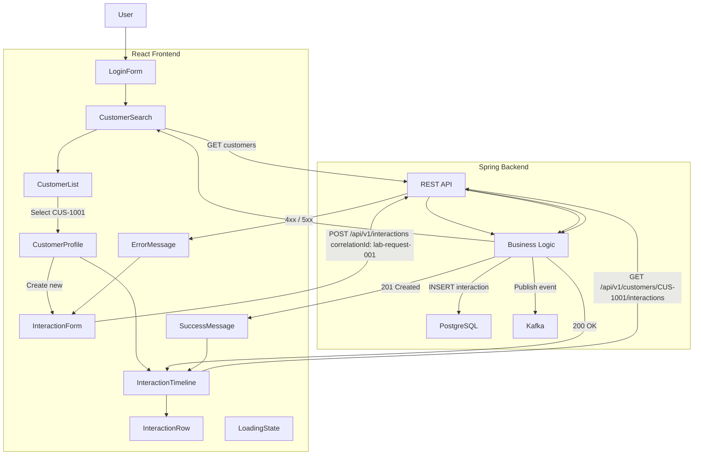

## Journey Mermaid


# Frontend Persistence Demo

## 1. Frozen End-to-End Journey

The frontend persistence demo follows this user journey:

1. User opens the React application.
2. The application loads the available customers.
3. User searches for either Amina Khan (`CUS-1001`) or Ravi Singh (`CUS-1002`).
4. User selects a customer.
5. The customer profile header is displayed.
6. The interaction timeline is loaded from the Lab 49 API.
7. User selects "New Interaction".
8. User fills out the interaction form.
9. The frontend sends `POST /api/v1/interactions`.
10. The write request includes:
    `X-Correlation-ID: lab-request-001`.
11. The backend persists the interaction in PostgreSQL.
12. The backend publishes the corresponding event to Kafka.
13. The API returns `201 Created`.
14. The frontend displays the newly created interaction.
15. The application is restarted/reloaded.
16. The customer is selected again.
17. The interaction timeline is fetched again from the backend.
18. The newly created interaction is still present, demonstrating that
    the data was persisted in PostgreSQL rather than only stored in
    frontend state.

## API Endpoints

### GET /api/v1/customers
Gets list of customers

**Response: 200 OK** List of Customers which shape of customer table (not implimented at this stage) (Only Amina and Ravi for now)

**Errors** 

- `404 Not Found` - List of customers is not available.

### GET /api/v1/customers/{customerId}/interactions
Get list of interactions from a customer

**Response: 200 OK** List of interaction rows 

**Errors / Notes**

- `204 No Content` - Successful response, however no interactions created for customer

- `404 Not Found` - Unknown or non-existent customerId

### POST /api/v1/interactions
Submits interaction to backend

**Request body:**
```json
{
  "customerId": "CUS-1001",
  "interactionType": "NOTE",
  "summary": "Follow-up on billing question",
  "correlationId": "lab-request-001"
}
```

**Response — `201 Created`:**
```json
{
  "id": "22cbd873-4930-49ec-9c80-830fb7b45f6d",
  "customerId": "CUS-1001",
  "interactionType": "NOTE",
  "summary": "Follow-up on billing question",
  "correlationId": "lab-request-001",
  "createdAt": "2026-08-18T20:11:32.103582300Z"
}
```

**Errors**

- `400 Bad Request` - Invalid request fields
- `404 Not Found` - Invalid or unknown customerId field


## Components

| Component             | Responsibility                    |
| --------------------- | --------------------------------- |
| `App`                 | Overall application state/routing |
| `LoginForm`           | Authentication                    |
| `CustomerSearch`      | Search/filter customers           |
| `CustomerList`        | Render customer results           |
| `CustomerProfile`     | Selected customer container       |
| `InteractionTimeline` | Fetch/render interactions         |
| `InteractionRow`      | Render one interaction            |
| `InteractionForm`     | Create interaction                |
| `LoadingState`        | Consistent loading UI             |
| `ErrorMessage`        | Error + retry                     |
| `EmptyState`          | No results/interactions           |
| `StatusBadge`         | Customer/interaction status       |
